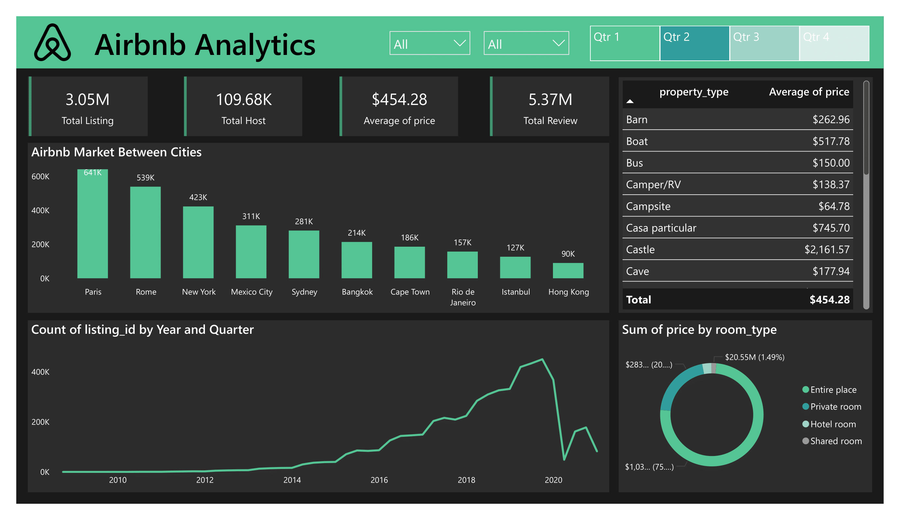

# Airbnb Listing and Review Analytics

## Dashboard
The interactive dashboard created in Power BI provides a visual representation of the findings, including city-wise distribution of properties, average rating per property type, and the correlation between price and reviews.

## Overview
This project focuses on analyzing Airbnb listings and customer reviews to uncover insights into property performance, host behavior, and guest satisfaction. The dataset includes details such as listing properties, host characteristics, pricing, review scores, and customer feedback, providing a comprehensive overview of the Airbnb marketplace.

## Project Objectives
- Analyze listing features such as location, price, and accommodation capacity.
- Examine host behavior, including the impact of being a "Superhost."
- Review guest feedback and ratings to assess property performance.
- Identify trends in property bookings and popular amenities.
- Evaluate how review scores influence booking behavior.

## Dataset
The dataset used for this project is sourced from Kaggle. You can access the dataset here:  
[Airbnb Listings and Reviews Dataset](https://www.kaggle.com/datasets/mysarahmadbhat/airbnb-listings-reviews)

## Key Insights
1. **Top Cities and Property Types**: Analysis of popular cities and property types based on the number of bookings and customer satisfaction.
2. **Superhost Influence**: The impact of Superhosts on booking trends and review scores.
3. **Price Trends**: Pricing analysis based on property type, location, and amenities.
4. **Customer Satisfaction**: Key factors affecting guest reviews, including cleanliness, accuracy, and communication.
5. **Amenity Preferences**: Identifying the most sought-after amenities among guests.

## Conclusion
The analysis highlights the significance of host reliability, property location, and guest satisfaction in driving Airbnb bookings. By understanding customer preferences and reviewing trends, hosts can optimize their property listings to attract more guests and improve overall satisfaction.
